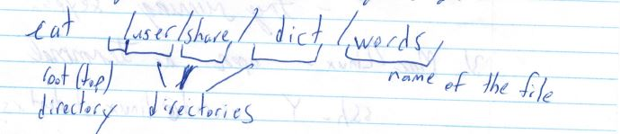

# CS246 - Lecture 1 - Sept 6, 2018

## Module 1: Linux Shell

shell: interface to the OS - get OS to run program/manage files/etc

- graphical {click/touch}
- command-line-type commands at a prompt
- more versatile

This course: bash (command line)

Make sure you\re running bash

login and type `echo $0` should say bash

if not:
www.student.cs.uwaterloo.ca/password

### Files, Input, Output

`cat` - displays the contents of a file



In linux a directory is just a special kind of file.

In Linux, every line of a valid test file must end with a newline character, INCLUDING THE LAST ONE!

Marmoset checks for this!

^C (i.e. CTRL + c) to stop (kills the program)

`ls` - lists files in the current directory (non-hidden files)

`ls - a` **all** files (incl. hidden)

### Hidden files
- name starts with a dot (.)

`pwd` - prints current directory

What if you just type `cat`? 
- Nothing happens
- `cat` is waiting for input - type something

Now, it prints every you type

**Usefule?** Maybe, if we can capture the output in a file ...

Observe:
 ```Bash
 cat > myfile.txt
 some words
 some more words
 ```

To stop: CTRL - D (^D) at the beginning of a line send a end of file (EOF) signal to cat.

Now `cat myfile.txt` outputs what we typed

In general:
```Bash
command arg > file
```

- Executes command args + captures the output in **file** instead of sending to the screen
- **output redirection**

Can also redirect input: `cat < file`
- takes input from file instead of keyboard
- displays **file**
- **seems** equivalet to cat file

What's the difference? (**Important**)
- `cat file` 
  - passes the name **file** in an **argument** to `cat`
  - `cat` opens the **file** + displays it
- `cat < file` 
  - the **shell** opens the file + passes the contents to `cat` in place of keyboard input
Also: `cat *.txt` called a **globbing pattern**
`*` = match any sequence of chars
- **shell** finds all files that match the pattern + substitutes them onto the command line

-> `cat myfile.txt myfile.txt`

`cat` opens each + displays (**concatenates**)

More globbing patterns - Linux sheet
Can do both input + output redir:
```Bash
cat < in > out
```
takes chars out of in + send them to out 
- copies the file argument

**Eg.**
```Bash
cat -n < in > out
```
copies into out with line # attached

Every process is attached to 3 streams


By default - stdin = keyboard, stdout/stderr = screen

Input redirection - connects stdin to a file (`<`)
output redirection - connects stdout to a file (`>`)

### stderr
- separate output stream for error messages.
- so output + error can go to different places
- so that error messages don't corrupt output formatting  

 
  
