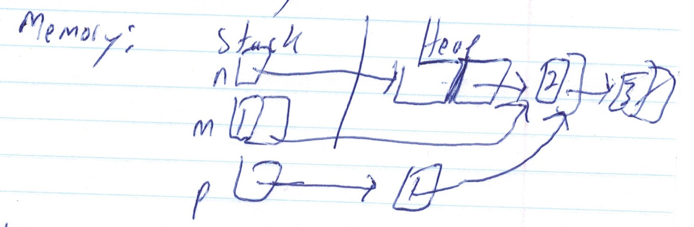
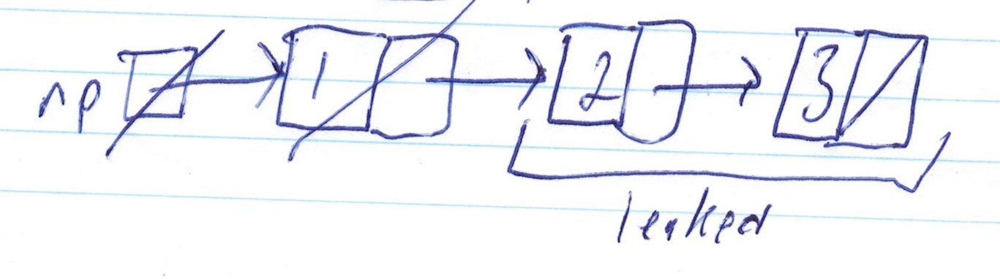

# CS246 - Lecture 10 - Oct 11, 2018

```C++
Node *n = new Node {1, new Node{2, new Node{3,nullptr}}};
Node m = *n;
Node *p = new Node {*n};
```


If you want a **deep copy** (copies the whole list), must write your own ctor

```C++
struct Node {
    Node (const Node &other): data {other, data},
    next {other.next ? new Node {* other.next}} : nullptr} {} 
    // recursively copies the rest of the list
};
```

### The copy ctor is called:

1. When an object is initialized by another object of the same type
2. When an object is passed by value 
3. When an object is returned by value from a function

... for now. Will change soon.

**Note:** Careful with ctors that can take **one** parameter.

**Eg.**
```C++
struct Node {
    ...
    Node (int data): data {data}, next {nullptr} {}
};
```

Single-arg ctors create implicit conversions

**Eg.**
```C++
Node n{4};
```
but also:
```C++
Node n = 4; //implicit conversion from int to Node
```

```C++
int f(Node n);
f(4); //Works - 4 is implicitly converted to Node
```
### Danger:
- accidentally passing an int to a function expecting a Node
- Silent conversion
- compiler doesn't signal an error
- potential errors not caught

### Disable the implicit conversion - make the ctor explicit

```C++
struct Node {
    ...
    (int data): data {data}, next {nullptr}{} // explicit
};

Node n {4}; // Ok
Node n = 4; // Wrong
f(4); // Wrong
f(Node {4}); //Ok
```

## Destructors

### When an object is destroyed 
(stack-allocated: goes out of scope &
heap-allocated: is deleted)

1. dtor body runs (classes come with a **destructor** - just calls dtors on all fields that are objects (reverse destructor order))
2. fields' dtors invoked in reverse declaration order (for fields that are objects)
3. space deallocated.

### When do we need to write a dtor?

```C++
Node *np = new Node {1, new Node {2, new Node{3, nullptr}}}
```
If `np` goes out of scope 
- `np` is reclaimed (stack-allocated)
- all 3 nodes leaked (heap-allocated)

If we say delete `np`; - calls *`np`'s dtor,



Write a dtor to ensure the whole list is freed:

```C++
struct Node {
    ...
    ~ Node() { delete next; } // recursively calls *next's dtor. Therefore, whole list is deallocated.
}
```
Now - delete `np;` frees the whole list.

## Copy Assignment Operator

```C++
Student billy {70, 80, 90};
Student jane = billy; // copy ctor.

Student joey; //default ctor
joey = billy; // copy, but not a construction
// copy assignment operator. -uses built-in implementation
```
### May need to write your own:
```C++
struct Node {
    ...
    // return the thing assigned so that cascading works. 
    // ex. x=y=z=3
    Node &operator = (const Node &other){
        data = other.data;
        delete next;
        next = other.next ? new Node {*other.next}: nullptr;
        return *this;
    }  
};
```

### But this is wrong and dangerous

### Why?

```C++
Node n {1. new Node {2, new Node {3, nullptr}}};
n=n; // deletes n and then tries to copy n to n
// undefined behaviour
```

Some examples of where self-assignment might happen:
```C++
*p = *q;
a[i] = a[j]; // if i and j are loop counters may be a self-assignment
n = m;
```

When writing operators = , **ALWAYS** watch out for self-assignment.

```C++
struct Node {
    ...
    Node &operator = (const Node &other) {
        if (this == &other) return *this;
        data = other.data;
        delete next;
        next = other.next ? new Node {*other.next} : nullptr; //if  new fails, function quits immediately 
        return *this;
    }
};
```
### What does this mean?
- assignment to next doesn't happen.
- next was deleted - dangling ptr 
- corrupted data structure

**Better:** 
Will be covered next class.


