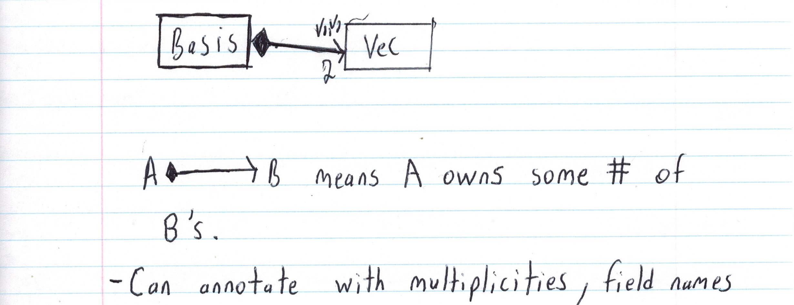
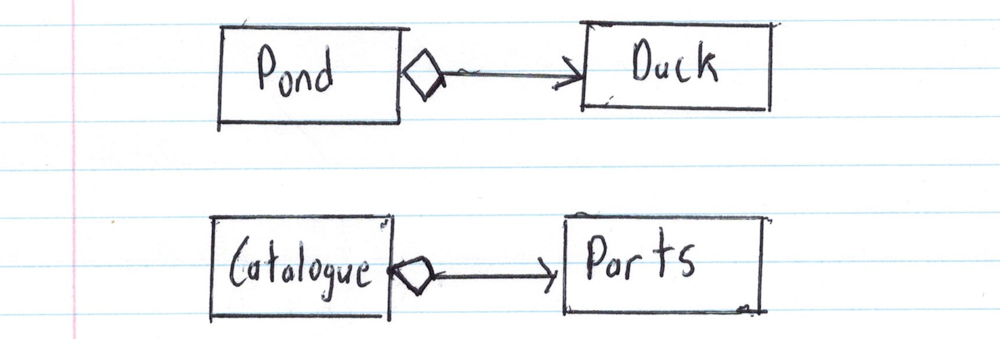

# CS246 - Lecture 14 - Oct 25, 2018

## Relationship: Composition of Classes

```C++
class Vec {
    int x, y;
  public:
    Vec(int x, int y) : x{x}, y{y} {}
};
```
Two vecs define a **basis**

```C++
class Basis {
  Vec v1, v2;
  ...
};

Basis b; // X doesn't compile
```
### Why?
  - can't initialize `v1`, `v2`
  - default ctor for `b` calls default ctor for `v1`, `v2` -doesn't exist

### Solution:

```C++
class Basis {
	Vec v1, v2;
public:
	Basis() : v1{1,0}, v2{0,1} {}	
  // HAS TO BE IN THE MIL since it would be too late to do it in the ctor body
};
```
## Composition

Embedding one obj (e.g. `Vec`) inside another (Basis) called **composition**

**Relationship:** A Basis "owns" two `Vecs`

- If A "owns" a B, then *typically* B has no identity outside A -> No independent existence.
- If A is destroyed, B is destroyed!
- If A is copied, B is copied. -> deep copy

**Ownership** is a crucial topic in this course.

**Eg.**
- A car owns four wheels. A wheel is part of a car
  - destroy the car -> destroy the wheels
  - copy the car -> copy the wheels

**Implementation** - **usually** as a composition of classes

#### Modeling:



## Aggregation - "has a" Relationship

Compare car parts in a car ("owns a") vs. car parts in a catalogue.
The catalogue contains the parts, but they exist solely on their own. They have an **independent existence**.

- The catalogue “has a” car part. (relationship)

If A "has a" B, then typically,
- B exists apart from its association with A. 
- If A is destroyed, B lives on
- If A is copied, B is not copied -> implying shallow copy
  - copies of A share the same B

**Ex.** Ducks in a pond. Parts in a catalogue. 

#### UML:



### Typical implemention: pointer fields
```C++
class Pond {
    Duck *duck[maxDucks];
    .
    .
    .
};
```

## Inheritance (specialization)

Suppose you want to track your collection of books.

```C++
class Book {
    string title, author;
    int length;

  public:
    Book();
  ...
};
```

For textbooks, you also want to know the topic.
```C++
class Text {
    string title, author;
    int length;
    string topic;
  public:
	  Text(____);
	  ...
};
```

For comic books, you want to know the hero.

|Comic|
|:---:|
|-title:string|
|-author:string|
|-length:integer|
|-hero:string|

All of this is okay but doesn't capture the relationships amoung Book, Text and Comic.
And how do we create an array (or linked list) that contains a mixture of these?

1.  Use a union
```C++
union BookTypes {Book *b, Text *t, Comic *c};
BookTypes myBooks [20];
```
**Problem:** how do you know which type an element is? You could out a `Text *t` as a `Comic *c`

2. Array of `void *` - ptr to anything \
   Problem: You have no clue about the type of the thing you’re pointing at.

1 and 2 are **not** good - not type safe

Rather, observe that 'Texts' and 'Comics' are kinds of books - Book’s with extra features.

### To model in C++ - Inheritance

```C++
// Base class or superclass
class Book {
  string title, author;
  int length;
public:
  Book(____);
  ...
};

// Derived classes (or subclass)
class Text : public Book {
  // string title, string author, int length are inherited
  string topic;
public:
  Text(___);
  // any methods from Book are inherited
};

class Comic : public Book {
    // string title, string author, int length are inherited
    string hero;
  public:
    Comic(___);
    // any methods from Book are inherited
};
```
Derived classes **inherit** fields and methods from the base class

So Text, Comic get title, author, length fields
Any method that can be called on Book can be called on Text, Comic.

**Q:** Who can see these members?
**A:** title, author, length are private in Book. Outsiders can’t see them.

**Q:** Can Text and Comic see them? \
**A:** No, even subclasses can’t see them.

**Q:** If Text and Comic can’t access those fields, how do they know they’re there? \
**A:** Because the Book might have accessor functions, that rely on the existence of the inherited fields.

**Q:** If they don’t have access to those fields, how do you initialize Text, Comic? \
**A:** To properly initialize Text, you need title, author, length and topic (to initialize the book part).

```C++
class Text : public Book {
    string topic;
  public:
    Text (string title, string author, int length, string topic) :
     title{title}, author{author}, length{length}, topic{topic} {}	// THIS IS WRONG
	...
};
```

### Wrong for 3 reasons:
1. You don't have access to those title, author, length fields!
2. You only are allowed to list **YOUR OWN FIELDS** in the MIL
3. When an object is created, the process of initializing includes one more step

### Constructing an Object:
1. Space is allocated.
2. Superclass part is constructed.      
3. Initialize all fields, call constructor on fields that are objects.
4. Ctor body runs.

But Step 2 is not possible because the Superclass does not have a default constructor

**Fix:** Invoke Book's ctor in Text's MIL:
```C++
class Text : public Book {
      string topic;
    public:
      Text (string title, string author, int length, string topic) :
       Book{title, author, length}, topic{topic} {}
               ^                       ^
     //      Step 2                  Step 3
      ...
};
```
If the superclass does not have a default ctor, subclass **MUST** invoke a superclass ctor in its MIL.


**Q:** what if the superclass does have a default ctor?

**A:** Good reason to keep superclass fields inaccessible to subclasses.
If you want to give the subclass access to certain members, you can use *protected* visibility.

**Eg.**
```C++
class Book {
  protected: // protected means accessible to book and it's subclasses
    string title, author;
    int length;
public:
	...
};

class Text : public Book {
    ...
  public:
    void addAuthor(string a) { author += a; } 
    // Ok (i.e. it works) but not good idea
    ...
};
```
It is not a good idea to give subclasses unlimited access to fields

**Better:**
- keep fields private
- provide protected accessors/mutators

```C++
class Book {
    string title, author;
    int length;

  protected:
    string getTitle() const; // subclasses can call
    void getAuthor(string newAuthor); // subclasses can call

  public:
    Book();
    bool isHeavy() const;
};
```
Relationship between Text, Comic, Book is called a “is a”
- A Text “is a” Book
- A Comic “is a” Book

#### UML:


Now consider the method `isHeavy` - When is book heavy?
- for ordinary books > 200 pages
- for Texts > 500 pages
- for Comics > 30 pages


