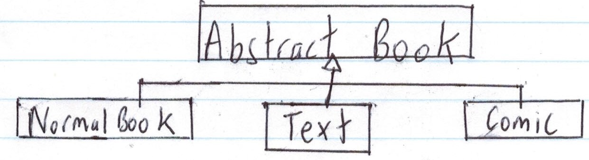

# CS246 - Lecture 16 - Nov 1, 2018

## Pure Virtual Methods and Abstract Classes

```C++
class Student {
  ...
  public:
    virtual int fees () const;
};
```

### 2 Kinds of Students: Regular + Co-op

```C++
class Regular : public Student {
  public:
    int fees() const override; // regular student fees
};

class CoOp : public Student {
  public:
    int fees() const override; // Co-op students' fees
}
```

What should we put for `Student::fees`?
Not sure - every Student should be Regular or Co-op.

Can explicitly give `student::fees` **NO** implementation.

```C++
class Student {
  ... 
  public:
    virtual int fees() const = 0; // Method has no (x) input - called a pure virtual method
}
```

A class with a **pure virtual** method cannot be instantiated. 

```C++
Student s; // wrong
```

- called an **abstract class** - purpose is to organize subclasses
- Subclasses of an abstract class are also abstract, unless they implement all pure virtual methods.
- Non-abstract classes are called **concrete**.

Regular/CoOp - concrete classes.

#### UML 
- virtual + pure virtual methods - *italics*
- abstract classes - class name in *italics*

## Inheritance and Copy/Move

```C++
class Book {
  // implement Big 5
};

class Text: public Book {
  // Does not implement copy/move operations.
};

Text t {___,___,____,____};

Text t2 = t; // No copy ctor in Text - what happens?
```

- calls Book's copy ctor
- then goes field by field (ie. default behaviour) for the Text part
- same for other operations

### To write your own operations:

```C++
Text::Text (const Text &other) : Book {other}, topic {other.topic} {}

Text &Text::operator = (const Text &other) {
  Book::operator = (other);
  topic = other.topic;

  return *this;
}


Text::Text (Text &&other) : Book {other}, topic {other.topic} {}
```
This is wrong because we aren't moving because other is an lvalue. \
**Note:** even though other "points at" an rvalue, other itself is an lvalue

```C++
#include <utility>

Text::Text (Text &&other) : Book {std::move(other)}, topic {std::move (other.topic)} {}

Text &Text::operator = (const Text &other) {
  Book::operator = (std::move(other));
  topic = std::move(other.topic);
  return *this;
}
```
`std::move(x)` forces an lvalue `x` to be treated as an rvalue, so that "move" versions of the operations run.

- operations given above are equivalent to the default - specialize as needed for Nodes, etc.

Now consider

```C++
Text t1 {....}, t2 {....};

Book *p1 = &t1, *p2 = &t2;

// what if we do
*p1 = *p2;
//?
```

- `Book::operator= runs`

**Partial assignment:** copies only the Book part.

### How can we fix this?

Try making `operator = ` virtual

```C++
class Book {
  ...
  public:
    virtual Book &operators= (const Book &other);
};

class Text:public Book {
  ...
  public:
  
  Text &operator= (const Text &other) override;
};
```

**Note:** different return types, but the **param** types must be the same, or it's not an override (and won't compile). - violates "is a"

```C++
class Book {
  ...
  public:
    virtual Book &operators= (const Book &other);
};

class Text:public Book {
  ...
  public:
  
  Text &operator= (const Book &other) override;
};
```

This means that assignment of Book object to a Text object would be allowed:

```C++
Text t {...};
Book b {...};

t = b; // uses Book to assign Text - BAD (but would compile)

// This is MIXED ASSIGNMENT

// Also:

comic c{____}; 
t = c; // REALLY BAD
```
If `operator=` is non-virtual assignment through base class ptrs.

If virtual - allows mixed assignment.

**Recommendation**: all superclasses should be **abstract**.

Rewrite the hierarchy:



```C++
class Abstract Book {
  string title, author;
  int length;
  
  protected: // prevents assignment through base class pointers from compiling. This means *pb1 = *pb2; won't compile
    Abstract Book &operator= (const Abstract Book &other);

  public:
    Abstract Book (_____);

    ...

    virtual ~Abstract Book () = 0; // Need at least one pure virtual method. If you don't have one, use the dtor.

}

class NormalBook : public AbstractBook {
  public:
    NormalBook (___);
    ~NormalBook ();

    NormalBook &operator= (const NormalBook &other) {
      Abstract Book::operator= (other);
      return *this;
    }

    // other classes similar
    // prevents partial + mixed assignment
};
```
**Note**: virtual dtor **MUST** be implemented, even though it is pure virtual.

```C++
Abstract Book::~AbstractBook () {}
```
- because the subclass dtor **WILL** call it.

## Templates

Huge topic - just highlights here.

```C++
class List {
  struct Node {
    int data;
    Node *next;
  };
  Node *theList;
  ...
}
```
### What if you want to store somethingg else?

We will continue on Tues.


