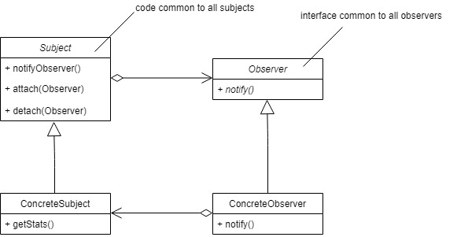
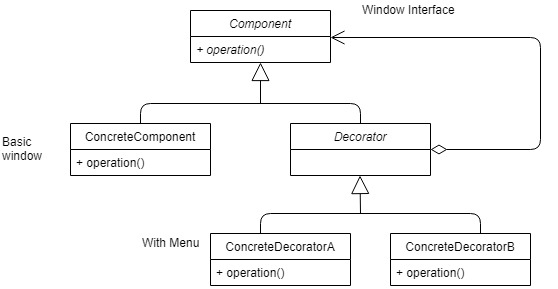
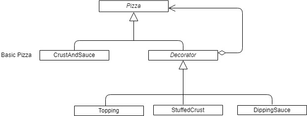

# CS246 - Lecture 18 - Nov 8, 2018

## Exceptions

A handler can act as a catch all

```C++
try {...}
catch (...)
{
  // catches all exceptions
}
```

You can throw anything you want - don't have to throw objects.

```C++
class BadInput {}; // writing your own exception class

.
.
throw BadInput{};
```

When new fails: throws `std::bad_alloc`

#### Never

- let a dtor throw an exception
- program will abort **immediately**
- if you want to let a dtor throw, you can tag it with noexception (false)

#### But
- if a dtor is running during stack unwinding, while dealing with another exception, and it throws, you now have **two** active, unhandled exceptions, and the program **will** abort immediately

Will be much more on exception later.

## Design Patterns - Observer Pattern

### Publish/Subscribe mode:

**One class**: publisher/subject - generate data
\>= 1 subscriber/observer classes - receive data and react to it.

**Eg.** subject - spreadsheet cells, observer = graph
- when cells change, graph updates

Can be many different kinds of observer objects - subject should not need to know all the details

### Observer patterns:



### Sequence of method calls

1. Subject's state is updated
2. `Subject::notifyObservers()` - calls each observer's notify
3. Each observer calls `ConcreteSubject::getState` to query the state and react accordingly

#### Examples:

Horse races
Subject - publishes winners
Observers - individual bettors - declare victory when their horse wins

```C++
class Subject {
    vector <Observer> observers;

  public:
    void attach (Observer *ob) {
      observers.emplace_back (ob); 
    }

    void deattach (Observer *ob); // remove from observers
    void notifyObservers () {
      for (auto &ob:observers) ob->notify();
    }

    virtual ~Subject() = 0;
};

Subject::~Subject() {}

class Observer {
  public:
    virtual void notify() = 0;
    virtual ~Observer(){}
};

class HorseRace: public Subject {
    ifstream in; // source of data
    string lastWinner;

  public:
    HorseRace (string source): in {source} {}
    bool runRace () {
      in >> lastWinner;
      return in;
    }
    string getState() {return lastWinner;}

};

class Bettor: public Observer {
  HorseRace *subject;
  string name, myHorse;

  public:
    Bettor (___): ____ {
      subject->attach(this);
    }

    ~Bettor() { subject->detach(this); }

    void notify() {
      string winner = subject->getState();
      if (winner == myHorse) cout << "win!";
      else cout << ";-(";
    }
};

// main

HorseRace hr;
Bettor Larry (&hr, "Larry", "RunsLikeACow");
//... (other bettors)


while (hr.runRace()) {
  hr.notifyObservers();
}
```

## Decorator Patterns

Want to add/remove functionality to/from an object at runtime. 

**Eg.** Windowing system
- start with basic window
- add scroll bar
- add menu

Want to choose these enhancements at runtime.

Decorator Pattern:



**Component** 
- interface - operations your objects will provide. 

**Concrete Component** 
- implements the interface - basic object. 

**Decorators:** 
- all inherit from Decorator, which inherits from component.
- every Decorator **is**  is component and **has** a component.

Window with scrollbar **is** a window, has a ptr to the underlying plain window

Window with scrollbar and menu **is** a window, **has**  a pointer to window with scroll bar, which has a pointer to window.

All inherit from `AbstractWindow` so window methods can be used polymorphically on all of them.

**Eg** Pizza



```C++
class Pizza {
 
 public:
  
  virtual float price() = 0;
  virtual std::string description() = 0;
  virtual ~Pizza();
};

class CrustAndSauce: public Pizza {
  public:
    float price() override;
    std::string description() override;
};

class Decorator: public Pizza {
  
  protected:
    Pizza *component;

  public:
    Decorator(Pizza *component): component {component} {}
    virtual ~Decorator() {delete component;}
};

class StuffedCrust: public Decorator {
  public:
    StuffedCrust(Pizza *component): Decorator{component} {}
    float price() { return component->price() + 2.69; }
    
    std::string description() 
    {
       return component->description() + " with stuffed crust";
    }
};
```


