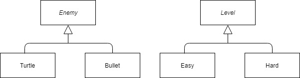
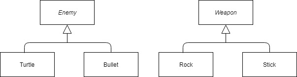

# CS246 - Lecture 19 - Nov 13, 2018

## Factory Method Pattern 

Write a video game with 2 kinds of enemies: turtles and bullets 

- system randomly sends turtles & bullets, but bullets are more frequent in harder levels



- never know exactly which enemy comes next, so call turtle/bullet constructors directly
- Instead, put a factory method in level that creates enemies

```C++
class Level {
  public:
    virtual Enemy * createEnemy() = 0; // factory method
};

class Easy : publlic Level {
  public:
    Enemy *createEnemy() override {
      // create mostly turtles
    }
};

class Hard : public Level {
  public:
    Enemy *createEnemy() override {
      // mostly bullets
    }
};

// Client:

Level *l = ______
Enemy *e = l->createEnemy();
```


## Template Method Pattern (best pattern - highly advocated for by the C++ community)

- want subclasses to override superclass behaviour, but some aspects must stay the same

**Eg.** there are red turtles and green turtles.

```C++
class Turtle {
  public:

    void draw() {
      drawHead();
      drawShell();
      drawFact();
    }

    private:
      void drawHead() {__________};
      void drawFact() {__________};
      virtual void drawShell() = 0;
}

class RedTurtle: public Turtle {
  void drawShell() override { /* draw red shell */}
};

class GreenTurtle : public Turtle {
  void drawShell() override {/* draw green shell */}
}
```

Subclasses can't change the way a turtle is drawn (head, shell, feet), but can change the way the shell is drawn 

Generalization : the Non-virtual Interface (NVI) idiom

- A public virtual method is really two things

#### Contradictory 
- an interface to the client
  - indicates provided behaviour with pre/post conditions
- an interface to subclasses
  - a "hook" to insert specialized behviour

It is hard to seperate these ideas if they are tied to the same function

What if want to split virtual method into two, maybe with some constant code in between? -> also changes client's interface

How could you make sure overriding functions conform to pre/condition?

#### NVI says:
- **all** public methods should be non-virtual
- **all** virtual methods should be private (or at least protected)
- (except the dtor)

### Example:

#### Before:

```C++
class DigitalMedia {
  public:
    virtual void play() = 0;
};
```
#### Now:

```C++
class DigitalMedia {
  public:
    void play() {
      doPlay(); // can add before and after methods
      // eg. check copyright update playcount
    }
  private:
    virtual void doPlay() = 0;
};
```

### Generalize Template Method
- puts **every** virtual function inside a template method.

## STL Maps - for creating dictionaries

**Eg.** "arrays" that map strings to int:

```C++

#include <map>

std::map <string, int> m;

m ["abc"] = 1;
m ["def"] = 4;

cout << m["ghi"] // If key is not present, it is in sorted order, and value is default constructed
cout << m["def"]; // 4

m.erase("abc");

if (m.count("abc")) // 0 = not found, 1 = found
```

Iterating over a map -> sorted key order

```C++ 
for (auto &p:m) {
          
  cout << p.first << " " << p.second << endl;
          //field           field
}
```

p's type is `std::pair <string, int>` (`<utility>`)

## Visitor Pattern

For implementing **double dispatch**

virtual methods - chosen based on the actual type (at runtime) of the receiving obj.

What if you want to choose based on **two** objects?



Want something like `virtual (Enemy, Weapon)::strike ();`

If strike is a method of Enemy (resp.Weapon) choose based on enemy (resp.weapon), but not a weapon (resp.enemy).

Trick to get dispatch on both (double dispatch) combines **overriding** with **overloading**


```C++
class Enemy {
  public: 
    virtual void beStructBy (Weapon &w) = 0;
};

class Turtle : public Enemy {
  public:
    void beStructBy (Weapon &w) override { 
      w.strike (*this); // *this is a Turtle 
    }

    class Bullet : public Enemy {
      public:
        void beStructBy (Weapon &w) override 
        {
          w.strike(*this); // *this is a Bullet
        }
    }
};

class Weapon {
  public:
    virtual void strike (Turtle &t) = 0; // overloads
    virtual void strike (Bullet &b) = 0; // overloads
};

class Stick : public weapon {
  public: 
    void strike (Turtle &t) override {
      // strike turtle with stick
    }

    void strike (Bullet &b) override {
      // strike bullet with stick
    }
};

Enemy *e = new Bullet {...};
Weapon *w = new Rock {...};

e->beStruckBy (*w); // What happens?
```

`Bullet::beStruckBy` runs (virtual method)

- calls `weapon::strike`, `*this` is Bullet
- Bullet version was chosen at compile-time.
- virtual method call resolves to Rock::strike (Bullet &)

Visitor can be used to add functionality to existing classes, without changing or recompiling classes themselves:

**Eg.** add a visitor to the Book Hierarchy:

```C++
class Book {
  public:
    ...
    
    virtual void accept (BookVisitor &v) {v.visit (*this); }
};

class Text: public Book {
  public: 
    ...
    void accept (BookVisitor &v) {v.visit (*this); }

};

// etc

```


