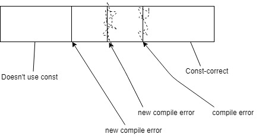
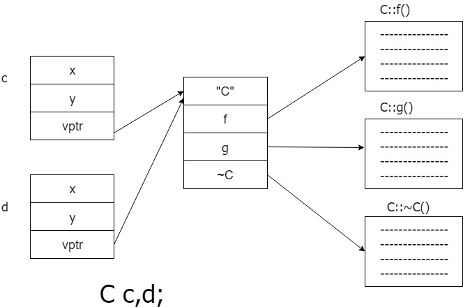
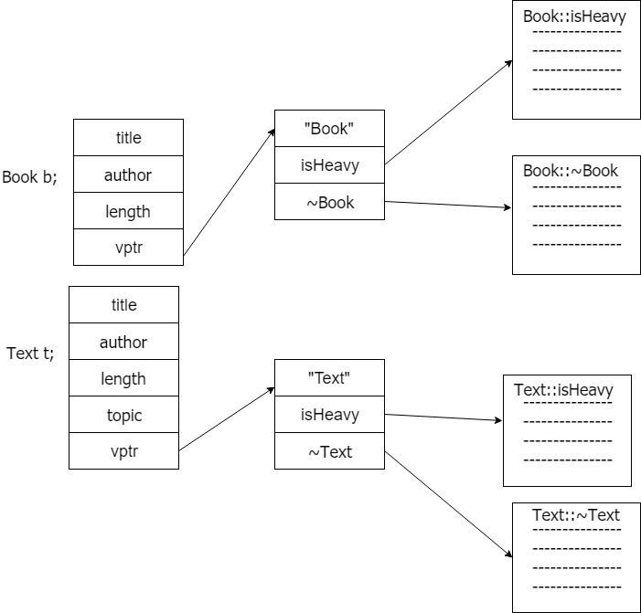
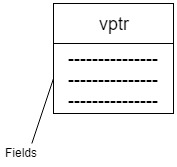
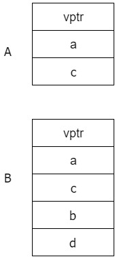

# CS246 - Lecture 23 - Nov 27, 2018

**Recall:**

2. `reinterpret_cast` - Unsafe, implementation-specific, "weird" conversions

```C++
Student s;
Turtle *t = reinterpret_cast<Turtle *>(&s);
```
3. `const_cast` - for converting between const and non-const
    - the only C++ cast that can "cast away const"

```C++
void g (int *p); // Suppose you know that g doesn't actually modify *p

void f (const int *p) {
    ...
    g(const_cast<int *>(p));
    ...
}
```




1. `dynamic_cast` - Is it safe to convert a `Book *` to a `Text *`?

```C++
Book *pb = ________;

static_cast<Text *>(pb)->getTopic(); // safe?
```

Depends on what pb actually points at
- Better to do a tentative cast - try it and see if it succeeds

```C++
Book *pb = ____;
Text *pt = dynamic_cast<Text *>(pb);
```

If the cast works (`*pb` really is a Text, or a subclass of Text), `pt` points at the obj.

If the cast fails, `pt` will be `nullptr`.

```C++
if (pt) cout << pt->getTopic();
else cout << "Not a Text";
```
Can we do this with smart ptrs?

- `static_pointer_cast`, `dynamic_pointer_cast`
- cast `shared_ptrs` to `shared_ptrs`

Can use dynamic casting to make decisions based on an object's Run-Time Type Information (RTTI)

```C++
void whatIsIt (shared_ptr<Book> b) {
    if (dynamic_pointer_cast <Comic>(b)) cout << "Comic";
    else if (dynamic_pointer_cast <Text>(b)) cout << "Text";
    else cout << "Book";
}
```
Code like this is tightly coupled to Book class hierarchy and may indicate bad design.

**Better:** use virtual methods, or write a visitor (if possible)

Dynamic casting also works with references.

```C++
Text t {...};
Book &b = t;
Text &t2 = dynamic_cast<Text &>(b);
```
If `b` "points to" a Text, then `t2` is a ref to the same Text.

If not ... (No such thing as a null reference)

- raises exception `std::bad_cast`

Note: dynamic casting only works on classes with at least one virtual method.

With dynamic ref casting, we can "solve" the polymorphic assignment problem:

```C++
Text &Text::operator= (const Book &other) { //virtual
    const Text &textOther = dynamic_cast<const Text &>(other); // throws if other is not a Text
    if (this == &textOther) return *this;
    Book::operator = (other);
    topic = textOther.topic;
    return *this;
}
```
## How Virtual Methods Work

```C++
class Vec {
        int x, y;
    public:
        int f();
};

class Vec2 {
        int x, y;
    public:
        virtual int f();
};
```

What's the difference?

```C++
Vec v{1, 2};
Vec2 w{1, 2}; 

// Do they look the same in memory?

cout << sizeof(v) << " " << sizeof(w) << endl;

// 8  16    ????
```

First note: 8 is space for 2 ints
- No space for the 'f' method

Compiler turns methods into oridinary f'ns + stores them separately from objects.

**Recall:** 

```C++
Book *pb = new ___ // Book, Text, or Comic
auto pb = make_unique <___ /* Book, Text, or Comic*/>();

pb->isHeavy();
```

If `isHeavy` is virtual - choice which version to run is based the type of actual object - which the compiler can't know in advance.

Correct `isHeavy` must be chosen at runtime. - How?
(implementation - specific - but every compiler does it this way)

C objects have an extra ptr (the **vptr**) that points to the C's vtable.

For each class with virtual methods, the compiler creates a table of function pointers (the **vtable**):

**Eg.** 

```C++ 
class C {
    int x, y;
    virtual void f();
    virtual void g();
    void h();
    virtual ~c();
};
```



**Eg.**



Calling a virtual method:

- follow vptr to vtable
- fetch ptr to actual method from table
- follow the function pointer + call the function

**Note:** all of this happens at runtime.


Therefore, virtual function calls incur a small cast.

**Also**: Declaring at least one virtual function adds a ptr to the object. -> also a space cost.

Concretely, how is an object laid out? - compiler-dependent.

#### g++
 

 ```C++
 class A {
     int a, c;
     virtual void f();
 };

 class B: public A {
     int b, d;
 };

```


- So we always know where the vptr is.

- So a ptr to B looks like a ptr to A if you ignore the last 2 fields.


