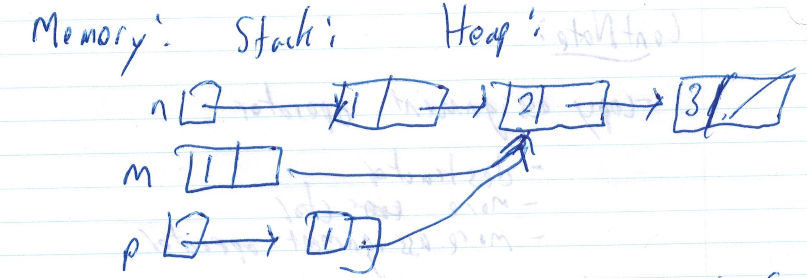

# CS246 - Lecture 9 - Oct 4, 2018

``` C++
struct Student {
    int assns, mt, final;
    float grade();
    
    float Student::grade(){
        return assns * 0.4 + mt * 0.2 + final * 0.4;
    }
}
```

What do `assns`, `mt`, `final` mean inside of `student::grade`?

They are fields of the **current** object - the object upon which grade was called.

eg.

``` C++
Student billy {...}
billy.grade(); //method call uses billy's assn, mt, final
```
**Fomally:** methods to take hidden extra parameter called this `this` - Ptr to the object which the method was called.

**Eg.**

``` C++
billy.grade();
```

**Note:**
```C++
this == &billy
```

So we can write:
``` C++
struct student {
    ...
    float grade() {
        return this->assns * 0.4 + this->mt * 0.2 + this->final * 0.4;
    }
};
```
**Note:** Methods can be written in the class. We will often do this for brevity. You should put implementations in .cc files.

## Initializing Objects:

``` C
Student billy {70, 80, 90}; // C-style struct initialization Ok, but limited
```

**Better:** Write a method that initializes - a **constructor** 
``` C++
struct Student {
  int assigns, mt, final;
  float grade() {
    return assigns * 0.4 + mt * 0.2 + final * 0.4;
  }

  Student (int assigns, int mt, int final) {
    this->assigns = assigns;
    this->mt = mt;
    this->final = final;
  }
};
```
``` C++
Student billy {70, 80, 90}; //better
```

- If a constructor has been defined, those arguments are passed to the constructor
- If **no** char has been defined, these initialize the individual fields of `Student`.

**OR** 
```C++
Student billy = Student {70, 80, 90};
```
### Heap allocation
```C++
Student * pBilly = new Student {70,  80, 90};
```

### Advantages of constructors:  
- default params
- overloading
- sanity checks

```C++
struct Student {
    ...
    Student (int assns = 0, int mt = 0, int final = 0) {
        ...
    }
};
```

```C++
Student jane {70, 80}, //70, 80, 0
```

**Note:** Every class comes with a defualt (ie. zero-arg) constructor (which just default contructs all fields that are objects)

**Eg.**
```C++
Vec v;  // default  ctor (does nothing in this case). 
        // But the built in default ctor goes away if you write any ctors.
```

**Eg**
``` C++
struct Vec {
    int x, y;
    
    Vec (int x, int y) {
        this->x = x;
        this->y = y;
    }
};
```

``` C++
Vec v; // Error!
Vec v {1, 2}; // OK
```

### What if a struct contains constants or refs?

``` C++ 
struct MyStruct {
    const int myconst; // must be initilized
    int &myREF; // must be initilized
}
```

```C++

// So initialize:

struct MyStruct {
  const int myConst = 5;
  int z;
  int &myRef = z;
};
```

But does **every** instance of `MyStruct` nweed to have the **same** value of `myConst`, etc?

**Eg.**

``` C++
struct Student {
    const int id; //constant (doesn't change) but not the same for all students!
};
```

### When do we initialize?
(ctor body? - too late - fields must be fully constructed by then)

### What happens when an object is created?
1. Space is allocated
2. Fields are constructed in declaration order - need to put on initialization heap (ctor run for fields that are objects)
3. Ctor body runs

How? 

## Member Initialization List (MIL)

``` C++
 Student(int assigns, int mt, int final):
     assigns{assigns}, mt{mt}, final{final} {}
 //    ^        ^
 //  fields   parameters
 ```

 ### This is step 2:
 ``` C++
 Student(int assigns, int mt, int final):
 ```
  ### This is step 3:
 ``` C++
 {}
 ```

 **Note:** can initialize **any** field this way, not just consts/refs.

 **Note:** Fields **always** initialized in **declaration order,** even if the MIL orders them differently.

 ### MIL - sometimes more efficient than setting fields in the body

 (otherwise runs default ctor in step 2, then reassign in step 3)

``` C++
 struct Student {
     string name;
     ...
 }
```

### What if a field is initialized inline **AND** in the MIL?

```C++
struct Vec {
    int x = 0, y = 0;

    Vec (int x): x {x} {}
}
```
### MIL takes precedence. Inline Field construction is only performed if the field is not mentioned in the MIL.

Now consider: 

```C++
Student billy {70, 80, 90};
Student bobby = billy; // How does this initialization happen?
```

**Note:** Every class comes with:
- default constructor (default-constructs all fields that are objects)
- copy ctor (just copies all fields)
- The **copy constructor** - for creating one object as a copy of another.
- copy assignment operator 
- destructor
- more ctor
- more assignment operator

## Building your own copy ctor:

``` C++
 struct Student {
    int assns, mt, final;
    ...
    student ( const stduent &other): 
    assn{other.assn}, mt{other.mt}, final{other.final} {}
}; //equiv to built-in
```

### When the built-in copy ctor is not correct?

Consider

```C++
struct Node {
    int data;
    Node *next;
}; //built-in copy ctor.

Node *n = new Node {1, new Node{ 3, new Node{ 3 nullptr}}};

Node m = *n; //copy ctor.
Node *p = new Node{*n};
```

## Linked list Diagram



Simple copy of fields -> only the first node i7s actually copied (shallow copy)

If you want deep copy (copies the whole list), must write your own copy ctor.